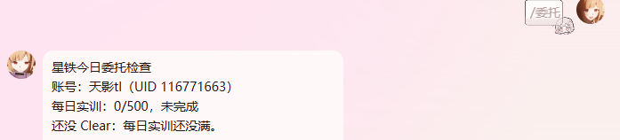
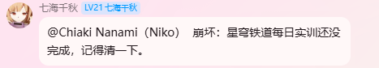

# astrbot_eryou_daily

<div align="center">


二游每日状态检查插件。支持在 QQ 群/私聊中查询星铁、原神、绝区零、异环每日完成情况和体力状态，并为未完成的每日设置群内 at 提醒。

</div>

## 效果演示

### 每日查询



### 群内提醒



## 功能特点

- 支持 `/委托` 一次检查已绑定的全部游戏。
- 支持 `/委托 星铁`、`/委托 原神`、`/委托 绝区零`、`/委托 异环` 单独查询。
- 支持米游社扫码绑定，群内发起绑定时二维码会私聊发送。
- 支持同一个米游社账号复用到多个米家游戏。
- 支持异环塔吉多手机号短信登录。
- 查询结果显示体力/资源：开拓力、原粹树脂、电量、本性像素、都市活力。
- 支持 `/委托设置 游戏名 时间`，到点未完成时在当前群 at 提醒。
- 支持 AstrBot WebUI 配置群白名单/黑名单。
- 不提交、不内置任何真实 Cookie；绑定数据只保存在本地 `data/` 目录。

## 支持游戏

| 游戏 | 绑定指令 | 检查内容 |
| --- | --- | --- |
| 崩坏：星穹铁道 | `/委托绑定 星铁` | 每日实训、开拓力、后备开拓力 |
| 原神 | `/委托绑定 原神` | 每日委托、凯瑟琳奖励、原粹树脂 |
| 绝区零 | `/委托绑定 绝区零` | 今日活跃、电量、刮刮卡 |
| 异环 | `/委托绑定 异环` | 今日活跃、本性像素、都市活力 |

## 安装方式

1. 在 AstrBot 插件管理页面上传插件压缩包，或将本仓库放入 AstrBot 插件目录。
2. 安装依赖：

```bash
pip install -r requirements.txt
```

3. 在 AstrBot WebUI 中重载插件。
4. 发送 `/委托帮助`，确认插件正常响应。

## 使用方法

### 绑定账号

先发送：

```text
/委托绑定
```

机器人会返回可绑定游戏。选择一个游戏：

```text
/委托绑定 星铁
/委托绑定 原神
/委托绑定 绝区零
/委托绑定 异环
```

星铁、原神、绝区零使用米游社扫码登录。机器人会直接生成米游社登录二维码。若在群里触发，二维码会私聊发送。用米游社 App 扫码并确认后，发送：

```text
/委托确认
```

绑定成功后，同一个米游社账号下的其它支持游戏可以继续用 `/委托绑定 游戏名` 绑定角色，不需要重复扫码。

异环使用塔吉多账号短信登录。发送 `/委托绑定 异环` 后，机器人会把绑定教程私聊给你。按下面步骤操作：

```text
/委托发码 13800138000
/委托确认 123456
```

请在私聊里发送手机号和验证码。插件只保存塔吉多 token 到本地 `data/` 目录，不会把手机号、验证码、token 提交到仓库。

### 检查每日

检查全部已绑定游戏：

```text
/委托
```

检查指定游戏：

```text
/委托 星铁
/委托 原神
/委托 绝区零
/委托 异环
```

### 设置提醒

提醒需要在群里设置，因为插件要知道到点后在哪个群 at 你。

```text
/委托设置 星铁 20:00
/委托设置 原神 20:00
/委托设置 绝区零 20:00
/委托设置 异环 20:00
```

格式：

```text
/委托设置 游戏名 时间
```

时间使用 24 小时制 `HH:MM`，例如 `08:30`、`20:00`。如果设置时今天这个时间已经过去，提醒会从明天开始，避免刚设置就立刻提醒。

### 解绑

```text
/委托解绑
```

会删除当前 QQ/平台用户在本插件中的本地米游社账号、游戏绑定和提醒设置。

## WebUI 配置

插件提供 `_conf_schema.json`，可在 AstrBot 插件设置页配置群过滤：

| 配置项 | 可选值 | 说明 |
| --- | --- | --- |
| `group_filter_mode` | `关闭` / `白名单` / `黑名单` | 控制群聊可用范围 |
| `whitelist_groups` | 群号列表 | 白名单模式下，仅这些群可用 |
| `blacklist_groups` | 群号列表 | 黑名单模式下，这些群不可用 |

私聊不受群白名单/黑名单影响。

## 数据与安全

绑定数据保存在插件目录：

```text
data/bindings.json
```

`data/` 已被 `.gitignore` 忽略。公开仓库、提交 PR、上传插件市场前，请不要提交真实 Cookie、绑定文件、二维码图片或包含账号凭证的日志。

## 常见问题

### 群里绑定为什么没有直接发二维码？

二维码会被机器人私聊发送，群里只会显示回执。如果收不到私聊，请先主动私聊机器人发送 `/委托绑定`。

### `/委托绑定 星铁` 后还需要 `/委托扫码` 吗？

不需要。现在指定游戏绑定时会直接生成二维码。`/委托扫码` 只作为二维码过期后的兼容入口。

### 为什么设置 `00:00` 后没有当天提醒？

如果你在当天 `00:00` 之后设置提醒，插件会从明天开始提醒，避免刚设置就立即触发。

### 异环为什么不用米游社扫码？

异环是完美世界游戏，账号数据来自塔吉多，不走米游社接口。插件参考了 [NTEUID](https://github.com/tyql688/NTEUID) 的塔吉多/老虎账号调用方式，只接入本插件需要的绑定、体力和每日状态查询。

## 更新日志

### v1.0.4

- 新增体力/资源显示：星铁开拓力、原神原粹树脂、绝区零电量。
- 新增异环绑定和查询：塔吉多手机号短信登录、今日活跃、本性像素、都市活力。
- 异环支持 `/委托 异环` 和 `/委托设置 异环 HH:MM`。

### v1.0.3

- 删除手机号/验证码登录入口中的米游社验证码方案。
- `/委托绑定 游戏名` 改为直接发送米游社扫码二维码。
- README 增加插件市场展示图和群内提醒效果图。

## 开源说明

本插件仅用于个人 AstrBot 实例中的游戏每日状态查询。接口数据来自米游社、塔吉多相关服务，请合理使用并保护好自己的账号凭证。
