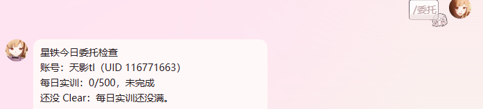
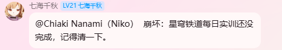

# astrbot_eryou_daily

<div align="center">


二游每日状态检查插件。支持在 QQ 群/私聊中查询星铁、原神、绝区零、异环每日完成情况和体力状态，并为未完成的每日设置群内 at 提醒。

</div>

## 效果演示

### 每日查询



### 群内提醒



## 功能特点

- 支持 `/委托` 一次检查已绑定的全部游戏。
- 支持 `/委托 星铁`、`/委托 原神`、`/委托 绝区零`、`/委托 异环` 单独查询。
- 支持米游社扫码绑定，群内发起绑定时二维码会私聊发送。
- 支持同一个米游社账号复用到多个米家游戏。
- 支持异环塔吉多手机号短信登录，可用 UID 指定角色。
- 查询结果显示体力/资源：开拓力、原粹树脂、电量、本性像素、都市活力。
- 支持 `/委托设置 游戏名 时间`，到点未完成时在当前群 at 提醒。
- 支持 AstrBot WebUI 配置群白名单/黑名单。
- 不提交、不内置任何真实 Cookie；绑定数据保存在 AstrBot 插件数据目录，卸载重装插件后仍会保留。

## 支持游戏

| 游戏 | 绑定指令 | 检查内容 |
| --- | --- | --- |
| 崩坏：星穹铁道 | `/委托绑定 星铁` | 每日实训、开拓力、后备开拓力 |
| 原神 | `/委托绑定 原神` | 每日委托、凯瑟琳奖励、原粹树脂 |
| 绝区零 | `/委托绑定 绝区零` | 今日活跃、电量、刮刮卡 |
| 异环 | `/委托绑定 异环` 或 `/委托绑定 异环 UID` | 活跃度、本性像素、都市活力 |

## 安装方式

1. 在 AstrBot 插件管理页面上传插件压缩包，或将本仓库放入 AstrBot 插件目录。
2. 安装依赖：

```bash
pip install -r requirements.txt
```

3. 在 AstrBot WebUI 中重载插件。
4. 发送 `/委托帮助`，确认插件正常响应。

## 使用方法

### 绑定账号

先发送：

```text
/委托绑定
```

机器人会返回可绑定游戏。选择一个游戏：

```text
/委托绑定 星铁
/委托绑定 原神
/委托绑定 绝区零
/委托绑定 异环
/委托绑定 异环 116771663
```

星铁、原神、绝区零使用米游社扫码登录。机器人会直接生成米游社登录二维码。若在群里触发，二维码会私聊发送。用米游社 App 扫码并确认后，发送：

```text
/委托确认
```

绑定成功后，同一个米游社账号下的其它支持游戏可以继续用 `/委托绑定 游戏名` 绑定角色，不需要重复扫码。

异环使用塔吉多账号短信登录。发送 `/委托绑定 异环` 后，机器人会把绑定教程私聊给你。账号里有多个异环角色时，建议直接带 UID：

```text
/委托绑定 异环 116771663
```

然后按下面步骤操作：

```text
/委托发码 13800138000
/委托确认 123456
```

请在私聊里发送手机号和验证码。插件只保存塔吉多 token 到 AstrBot 插件数据目录，不会把手机号、验证码、token 提交到仓库。

### 检查每日

检查全部已绑定游戏：

```text
/委托
```

检查指定游戏：

```text
/委托 星铁
/委托 原神
/委托 绝区零
/委托 异环
```

### 设置提醒

提醒需要在群里设置，因为插件要知道到点后在哪个群 at 你。

```text
/委托设置 星铁 20:00
/委托设置 原神 20:00
/委托设置 绝区零 20:00
/委托设置 异环 20:00
```

格式：

```text
/委托设置 游戏名 时间
```

时间使用 24 小时制 `HH:MM`，例如 `08:30`、`20:00`。如果设置时今天这个时间已经过去，提醒会从明天开始，避免刚设置就立刻提醒。

星铁会在**每周日的同一设定时间**额外检查每周积分（差分宇宙、货币战争等共享的周积分，不是每周同步点）。例如 `/委托设置 星铁 20:00` 会在周日 20:00 检查积分是否已满，即使每日实训已完成，周积分未满也会在本群 at 你。两项都未完成时合并为一条提醒。

已有星铁提醒设置自动生效，不需要重新绑定。`/委托 星铁` 也会显示每周积分；目标优先使用米游社返回的上限，缺失时采用 18000。积分字段缺失时会提示无法确认，不会显示为 0。时间和星期沿用机器人服务器的系统时区，请确保服务器时区符合你的预期。

### 解绑

```text
/委托解绑
```

会删除当前 QQ/平台用户在本插件中的本地米游社账号、游戏绑定和提醒设置。

## WebUI 配置

插件提供 `_conf_schema.json`，可在 AstrBot 插件设置页配置群过滤：

| 配置项 | 可选值 | 说明 |
| --- | --- | --- |
| `group_filter_mode` | `关闭` / `白名单` / `黑名单` | 控制群聊可用范围 |
| `whitelist_groups` | 群号列表 | 白名单模式下，仅这些群可用 |
| `blacklist_groups` | 群号列表 | 黑名单模式下，这些群不可用 |

私聊不受群白名单/黑名单影响。

## 数据与安全

v1.0.12 起，绑定数据保存在 AstrBot 规范的插件数据目录，不再放在插件目录或用户 Home 目录：

```text
data/plugin_data/astrbot_eryou_daily/bindings.json
```

其中 `data` 是运行 AstrBot 的数据目录。Docker 部署时，如果宿主机把 `/root/data` 挂载到容器 `/AstrBot/data`，宿主机对应文件为：

```text
/root/data/plugin_data/astrbot_eryou_daily/bindings.json
```

从 v1.0.4 及更早版本的插件目录数据、或 v1.0.5 至 v1.0.11 的用户 Home 目录数据升级时，插件会在启动时自动迁移。常规迁移会把旧 `bindings.json` 移动到规范位置；如果规范位置已经有数据，则把旧文件移动到同一规范目录下的 `bindings.*.legacy.json` 备份，避免旧 Cookie 留在用户 Home 目录。旧二维码图片也会一并移入规范目录。

如果旧数据文件已经被手动删除，插件无法凭空恢复旧绑定，需要重新绑定。公开仓库、提交 PR、上传插件市场前，请不要提交真实 Cookie、绑定文件、二维码图片或包含账号凭证的日志。

## 常见问题

### 群里绑定为什么没有直接发二维码？

二维码会被机器人私聊发送，群里只会显示回执。如果收不到私聊，请先主动私聊机器人发送 `/委托绑定`。

### `/委托绑定 星铁` 后还需要 `/委托扫码` 吗？

不需要。现在指定游戏绑定时会直接生成二维码。`/委托扫码` 只作为二维码过期后的兼容入口。

### 为什么设置 `00:00` 后没有当天提醒？

如果你在当天 `00:00` 之后设置提醒，插件会从明天开始提醒，避免刚设置就立即触发。

### 异环为什么不用米游社扫码？

异环是完美世界游戏，账号数据来自塔吉多，不走米游社接口。插件参考了 [NTEUID](https://github.com/tyql688/NTEUID) 的塔吉多/老虎账号调用方式，只接入本插件需要的绑定、体力和每日状态查询。

### 异环显示 `100/100`，为什么仍然提示无法确认？

塔吉多的 `roleHome` 可能保留上一次登录异环时的快照，而且响应中没有数据更新时间。NTEUID 和公开的塔吉多客户端也没有强制同步游戏数据的接口，因此插件不能把跨日未变化的 `100/100` 直接算成今天已完成。

插件会保存累计登录天数和活跃度快照。能够确认数据当天已经变化时，才会显示“已完成”；无法确认时会明确标注，并在定时任务中按未完成提醒，避免漏报。首次使用没有历史基线，可能需要等下一次数据变化后才能确认。

### 重装插件后绑定还在吗？

v1.0.12 起会保留。数据在 `data/plugin_data/astrbot_eryou_daily/bindings.json`，不在插件目录里。卸载或覆盖安装插件不会删除这个文件。

## 更新日志

### v1.0.13

- 复审发版：版本号提升至 v1.0.13，插件行为与 v1.0.12 一致。

### v1.0.12

- 绑定数据、塔吉多 token 和二维码图片统一保存到 AstrBot 规范插件数据目录 `data/plugin_data/astrbot_eryou_daily/`。
- 启动时自动迁移插件目录和用户 Home 目录中的旧绑定数据；规范目录已有数据时，旧凭据会移动到同目录 legacy 备份，不再留在外面。

### v1.0.11

- 星铁新增每周积分显示，周日按原提醒时间检查，未满则群内 at。
- 每日实训已完成不影响周积分提醒；同日同群合并提醒并去重。
- 兼容接口积分上限，读取不完整时明确提示无法确认。

### v1.0.10

- 异环增加跨日旧快照识别，缓存的昨日 `100/100` 不再误判为今日完成。
- 数据未同步时明确显示“无法确认”，定时任务按未完成提醒。
- 异环快照基线保存在绑定数据文件中，重装插件后仍保留。

### v1.0.9

- 塔吉多账号没设主绑定角色时自动绑定（对齐 NTEUID），排查数据不同步问题。
- 新增 `/委托调试 异环`：查看 roleHome 接口原始字段。

### v1.0.8

- 修复异环体力（本性像素）和都市活力读取异常：接口协议版本回退到与安卓 App 一致的 `1.2.4`，并与参考实现 NTEUID 对齐。
- 塔吉多 token 刷新成功后立即落盘，查询中途失败不再丢失登录态。
- refresh token 失效时自动用老虎账号凭据重新登录，大幅减少“请重新绑定异环”。
- token 刷新与绑定文件读写加锁，避免提醒任务和手动查询并发时刷废登录态。

### v1.0.7

- `/委托绑定 异环` 不再读取可能失效的旧塔吉多登录态，改为直接私聊发送重新登录教程。
- `/委托绑定 异环 UID` 会保留指定 UID，并在短信登录成功后绑定对应角色。
- 异环查询遇到登录态失效时，会明确提示重新绑定，不再只显示 HTTP 402。

### v1.0.6

- 跟随塔吉多官网当前客户端，将接口协议版本更新为 `1.2.5`。
- 塔吉多接口返回 HTTP `401`、`402` 或 `403` 时，自动刷新登录态并重试原请求一次。
- 刷新后的 access token 和 refresh token 会继续写回绑定数据，避免下一次查询重复失败。

### v1.0.5

- 绑定数据移出插件目录，卸载重装插件后仍会保留。
- 旧版 `data/bindings.json` 存在时会自动迁移。
- 异环“今日活跃”改名为“活跃度”，避免和绝区零文案混淆。
- 异环支持 `/委托绑定 异环 UID` 指定角色，多角色账号不再默认选择第一个。
- 异环提醒改为检查活跃度；周日会额外检查都市活力是否清完。
- 查询和提醒文案改为“娜娜米提醒”风格，去掉不清楚的英文完成提示。

### v1.0.4

- 新增体力/资源显示：星铁开拓力、原神原粹树脂、绝区零电量。
- 新增异环绑定和查询：塔吉多手机号短信登录、活跃度、本性像素、都市活力。
- 异环支持 `/委托 异环` 和 `/委托设置 异环 HH:MM`。

### v1.0.3

- 删除手机号/验证码登录入口中的米游社验证码方案。
- `/委托绑定 游戏名` 改为直接发送米游社扫码二维码。
- README 增加插件市场展示图和群内提醒效果图。

## 开源说明

本插件仅用于个人 AstrBot 实例中的游戏每日状态查询。接口数据来自米游社、塔吉多相关服务，请合理使用并保护好自己的账号凭证。
